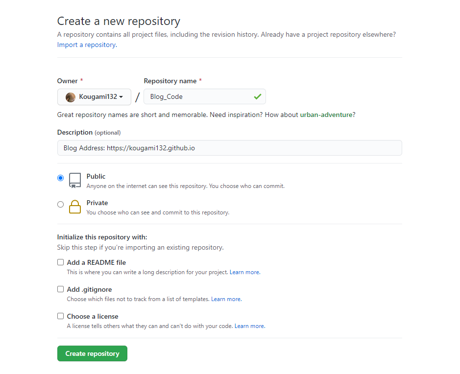
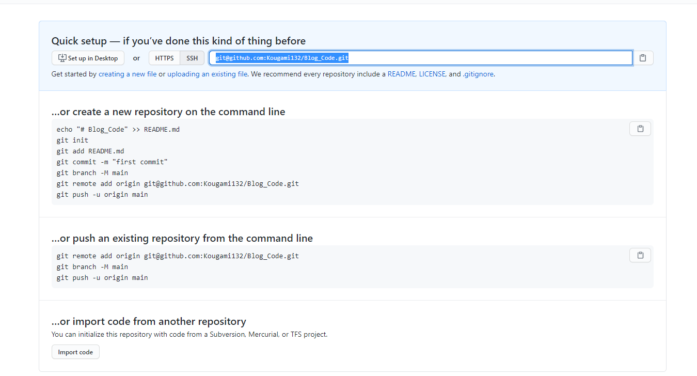
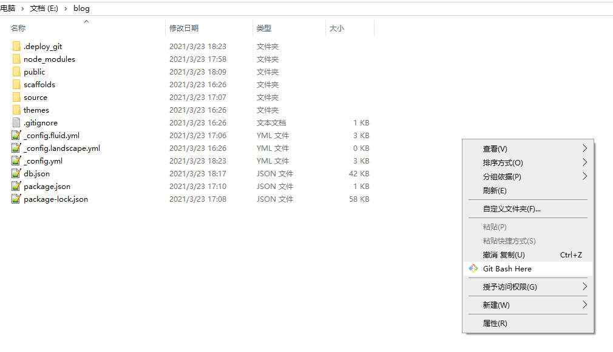
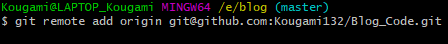
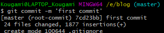
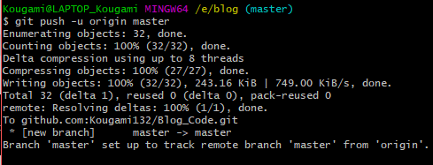
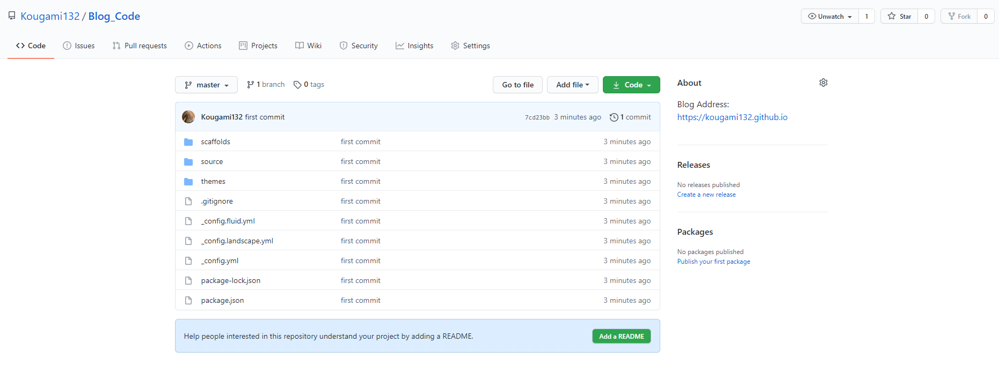
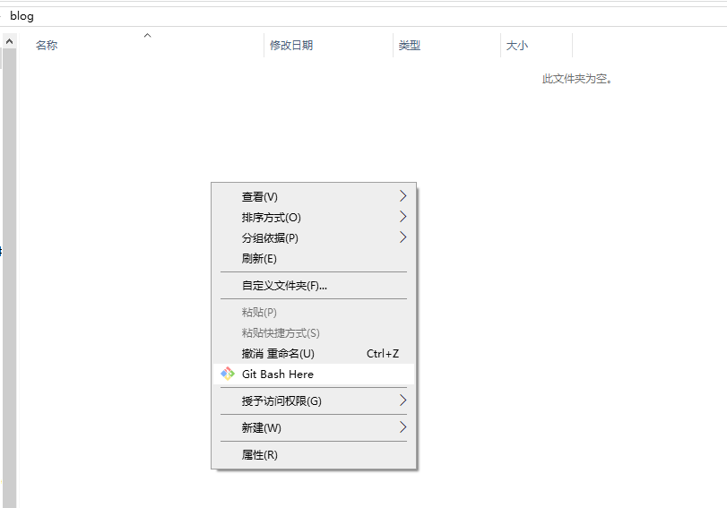
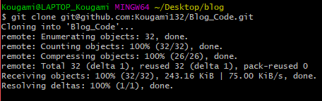
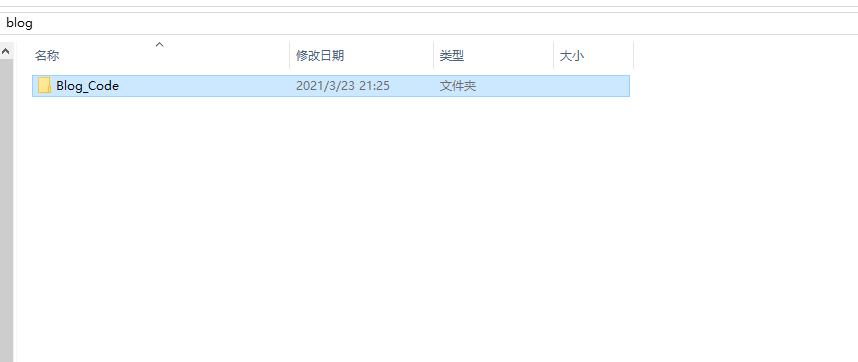

## 1. 安装git

[git下载地址](https://git-scm.com/downloads)

## 2. 本地git连接github账号

[本地git工具绑定github账号](./本地git工具绑定github账号.md)

## 3. 创建github仓库

创建仓库并**复制**仓库地址





## 4. 本地项目初始化并连接仓库

打开项目文件右键选择 `Git Bash Here`



初始化git，把这个文件夹变成Git可管理的仓库

```
git init
```

把本地项目的**origin**分支与github仓库进行关联

```
git remote add origin {复制过来的仓库地址}
```



## 5. 把项目上传到github

查看文件状态

```
git status
```


把工作区的文件添加到暂存区

```
git add . #.代表所有更改过的文件
```


把暂存区的文件提交到本地仓库

```
git commit -m 'first commit' #''里写注释
```



把本地仓库的**origin**分支文件push到github仓库的**master**分支

```
git push -u origin master #第一次提交由于远程仓库为空所以带-u，以后就不带
```



提交完成



## 6. 拉取项目到本地

在要拉取项目的文件夹右键选择 `Git Bash Here`



拉取项目

```
git clone {项目仓库地址}
```





## 7. 更新项目

